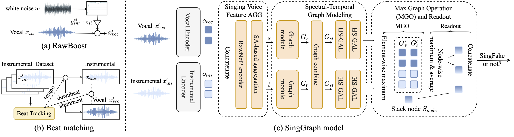
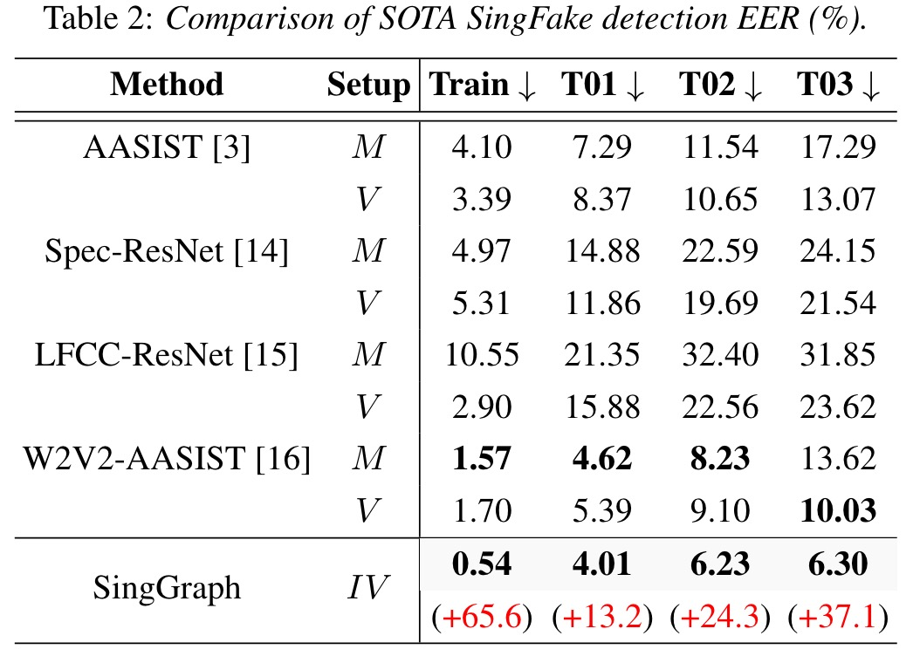

# SingGraph

[](https://arxiv.org/abs/2406.03111)

This is the official repository for the **[SingGraph](https://arxiv.org/abs/2406.03111)** model. The paper has been accepted by Interspeech 2024.
The official code will be released as soon as possible.
## Abstract

Existing models for speech deepfake detection have struggled to adapt to unseen attacks in this unique singing voice domain of human vocalization. To bridge the gap, we present a groundbreaking SingGraph model. The model synergizes the capabilities of the MERT acoustic music understanding model for pitch and rhythm analysis with the wav2vec2.0 model for linguistic analysis of lyrics Additionally, we advocate for using RawBoost and beat matching techniques grounded in music domain knowledge for singing voice augmentation, thereby enhancing SingFake detection performance.
Our proposed method achieves new state-of-the-art (SOTA) results within the SingFake dataset, surpassing the previous SOTA model across three distinct scenarios: it improves EER relatively for seen singers by 13.2\%, for unseen singers by 24.3\%, and unseen singers using different codecs by 37.1\%.



## Datasets and preprocessing
The dataset is based on the paper  "SingFake: Singing Voice Deepfake Detection," which is accepted by ICASSP 2024. [[Project Webpage](https://singfake.org/)]

Since the copyright issue, the dataset didn't open source. Please follow the instructions in the above paper to download the dataset yourself.

<!-- ## Training -->

<!-- ## Evaluation -->

## Comparison with the SOTA model

<div class="center" style="text-align: center">
    <div class="center col-md-8" style="text-align: center">
        
    </div>
</div>

## Citation
If you find our work useful, please consider cite
```
@misc{chen2024singing,
      title={Singing Voice Graph Modeling for SingFake Detection}, 
      author={Xuanjun Chen and Haibin Wu and Jyh-Shing Roger Jang and Hung-yi Lee},
      year={2024},
      eprint={2406.03111},
      archivePrefix={arXiv},
      primaryClass={eess.AS}
}
```
## Acknowledgement
If you have any questions, please feel free to contact me by email at d12942018@ntu.edu.tw.
